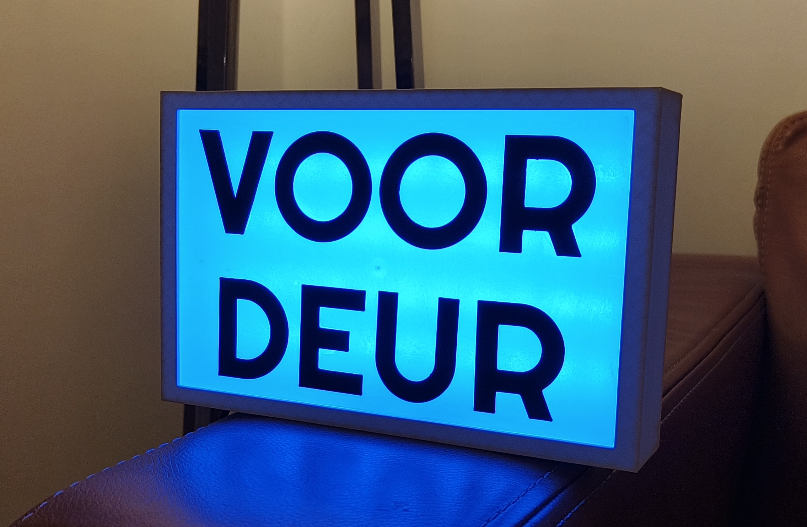

# LoRaWAN P2P Tally door light

This device contains an 'on-air' like light that connects directly to a doorsensor via LoRaWAN.
The idea is that the light will blink whenever the door opens. Also and fades into a constant light whenever the door stays open for too long. It also indicates when the battery energy is low.

The communication with the doorsensor and the light happens via LoRaWAN. In order to circumvent the need of a gateway, a significant part of the LoRaWAN 1.0.2 stack is implemented into the light. It supports:

- Both ABP and OTAA activation modes
- Confirmed and Unconfirmed Data Up
- Link Check Requests

As this will be a single channel receiver, ADR is not implemented and disabled by default.

# Bill of Materials
For this light the following

- 1 *Dragino LDS02* doorsensor.
- 1 *NodeMCU ESP8266* microcontroller. (Any other 3.3v microcontroller will work)
- 1 *WS2812B* RGB ledstrip. (Above example uses 44 leds)
- 1 *HopeRF RFM95W* Lora Receiver
- Cables and charger
- Acces to a 3d printer

# 3D Design
In the folder `/case/prints` there are three models one can print.
The files `front.stl` and `back.stl` are the enclosure of the light.
Seperately, one needs to find a semi translucent sheet of plastic that act as the front glass plane. One has to glue that plane to the front using super glue. The back and front can be bolted together using m3 bolts. The holes are designed a bit too small, so one can drill them to size.

In the file `text.stl` one can find the text *Voordeur*. These letters van be glued to the front plane using super glue. In order to position them correctly, a placing template is added to the file.

# Code
The folder `/firmware` contains the source code that one has to flash to the NodeMCU. Using VSCode and PlatformIO one can compile and flash the microcontroller. The main code is inside `main.cpp`. In the beginning of the file, there are variables one can change to to ones own preferences.

- Settings w.r.t. the ledstrip
	- __NUM_LEDS__: Number of leds on the RGB strip. Default 44
- Settings w.r.t. LoRaWAN
	- __FREQUENCY__: Frequency the LoRa receiver listens on. *Default 868.1MHz.*
	- __SPREADING_FACTOR__: Spreading factor the LoRa receiver listens on. *Default SF9 or DR3.*
	- __devAddr__: Device Address of the door sensor.
	- __devEUI__: Device EUI of the door sensor.
	- __appEUI__: Application EUI of the door sensor.
	- __appKey__: Application key of the door sensor.
- Settings w.r.t. Colors
	- __COLOR_BOOT__: Color to show at boot. *Default orange.*
	- __COLOR_DOOR__: Color to show when door opens. *Default green.*
	- __COLOR_CONSTANT_OPEN__: Color to show when door stays open. *Default blue.*
	- __COLOR_BATTERY__: Color to add to the above when battery is running low. *Default red.*
	- __COLOR_JOIN__: Color to show when doorsensor joins device. *Default purple.*
- Settings w.r.t. pinout
	- __LORA_CS_PIN__: ModeMCU pin that is connected to the Lora chip select pin. *Default `D8`.*
	- __LORA_RESET_PIN__: ModeMCU pin that is connected to the Lora seset pin. *Default `D1`.*
	- __LORA_IRQ_PIN__: ModeMCU pin that is connected to the Lora dio0 pin. *Default `D2`.*
	- __WS2812B_PIN__: ModeMCU pin that is connected to the ledstrip. *Default `D0`.*
- Other settings
	- __LOW_BATTERY_VOLTAGE__: Voltage that is considered low. *Default 2100mV.*
	- __CONSTANT_OPEN_TIME__: Time after the constant light has to fade in. *Default 30 seconds.*

# Wiring 
Unless changed, connect the led strip as follows:

- __+5V__: Connect to the __VIN__ pin of the NodeMCU
- __GND__: Connect to one of the __GND__ pins of the NodeMCU
- __DIN__: Connect to one of the __D0/GPIO16__ pin of the NodeMCU

Unless changed, connect the LoRa receiver as follows:

- __GND__: Connect to one of the __GND__ pins of the NodeMCU
- __MISO__: Connect to one of the __D6/GPIO12__ pin of the NodeMCU
- __MOSI__: Connect to one of the __D7/GPIO13__ pin of the NodeMCU
- __SCK__: Connect to one of the __D5/GPIO15__ pin of the NodeMCU
- __NSS__: Connect to one of the __D8/GPIO15__ pin of the NodeMCU
- __RESET__: Connect to one of the __D1/GPIO5__ pin of the NodeMCU
- __DIO0__: Connect to one of the __D2/GPIO4__ pin of the NodeMCU
- __3.3v__: Connect to the __3.3V__ pin of the NodeMCU
- __ANA__: Connect to the antenna

Leave the rest unconnected.

# Update Door sensor
By default the doorsensor won't work with the light as it will communicates with the all 8 channels while we can only receive one. For this we have to set it into single channel mode. To do this we have to send the configure the device using AT commands. See the *[Wiki](https://wiki.dragino.com/xwiki/bin/view/Main/User%20Manual%20for%20LoRaWAN%20End%20Nodes/LDS02%20-%20LoRaWAN%20Door%20Sensor%20User%20Manual/)* for more information. We run the following commands. Comments should not be send to the doorsensor!

    AT+CDEVEUI=8149d6562deaff58 // Replace this with your own DevEUI.
    AT+CAPPEUI=989ffc2d10fdbd11 // Replace this with your own AppEUI.
    AT+CAPPKEY=ed152d83e2b9ff1ff08825912f0feea5 // Replace this with your own AppKey.
    AT+CCONFIRM=1 // Set mode to confimed
    AT+CADR=0 // Disable ADR
    AT+CRX1DELAY=1 // SET RxWindowDelay to 1 second.
    AT+TTRIG=0,0 // Disable Alarm as we implemented our own alarm in code.
    AT+CHS=868100000 // Set single channel mode's frequency
    AT+CDATARATE=3 // Set Data rate
    AT+CSAVE // Save settings
